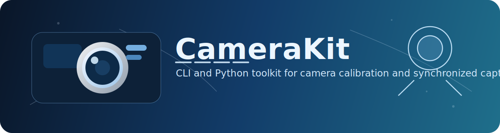

CameraKit Documentation
=======================

CameraKit is a CLI-first Python toolkit for multi-camera calibration and synchronized capture.

Stable capabilities
-------------------

- Camera discovery with supported resolution/FPS/codec probing (`camerakit devices`).
- Project bootstrap with default calibration layout (`camerakit init`).
- Checkerboard-based calibration (intrinsics + optional extrinsics) (`camerakit calibrate`).
- Interactive synchronized capture with per-trial recordings (`camerakit capture`).
- Calibration TOML summaries (`camerakit report`).

.. toctree::
   :maxdepth: 2
   :caption: User Guide

   quickstart
   cli
   calibration
   capture
   python-api
   file-format

.. toctree::
   :maxdepth: 2
   :caption: Project

   development
   roadmap
   release-notes
